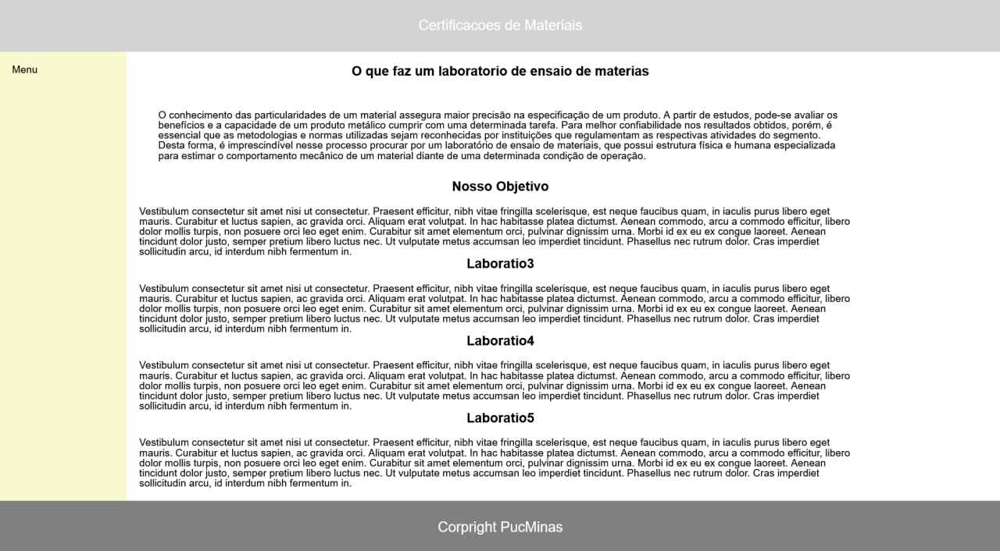
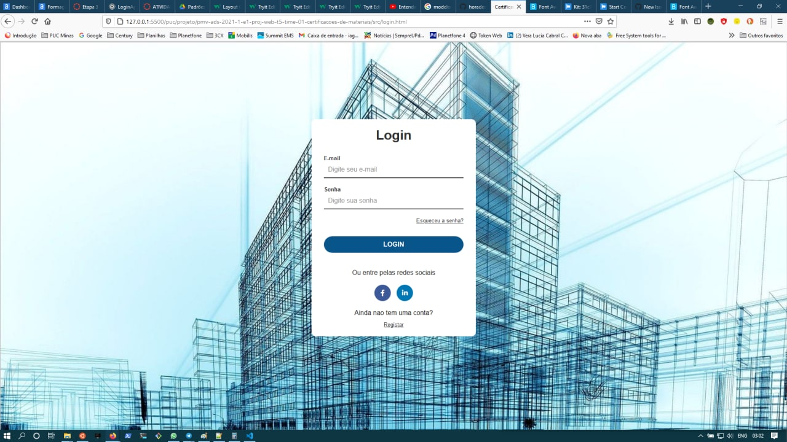

#
# 6. Template do Site

O padrão de layout a ser utilizado pelo site tem correspondência ao projeto de Interface elaborado anteriormente, conforme Figura 6.

O template criado está disponível no site [http://github.com/…](http://github.com/%E2%80%A6).. e é composto pelos seguintes layouts:

- Tela Principal
- Tela de Login

A responsividade segue o padrão do Bootstrap.

### Tela Principal

Tela de apresentação do projeto e que também proporciona ao usuário o conhecimento das funcionalidades do site: objetivos, cadastros, noticias, contatos entre outros.

Figura 13 - Tela Principal do site

### Tela de Login

Tela para autenticação dos administradores do site.

Figura 14 - Tela de Login

